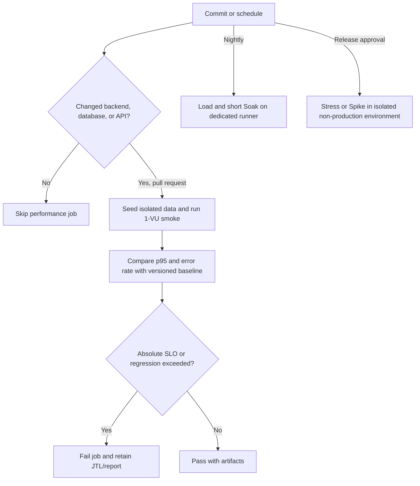

# Continuous Performance Testing Proposal

## Decision flow

## Gates

Pull requests run only a small Scenario B smoke when backend, database, JMX, fixture, or runner paths change. The job fails when p95 exceeds the approved absolute SLO, error rate exceeds the approved limit, or p95 regresses beyond a versioned tolerance. A regression comparison is valid only against a compatible runner, dataset, commit class, and JMeter configuration.

Nightly jobs may run Load and short Soak on a dedicated runner. Stress and Spike require release-owner approval and an isolated environment. They must never target production because they intentionally seek saturation or rapid overload.

## Trade-offs

- Shared runners add CPU and network noise; use repeated baselines or a dedicated runner before enforcing a tight p95 gate.
- Longer tests increase cost and feedback time; keep PR smoke small and move Load/Soak to scheduled jobs.
- One noisy run can create a false alarm; retain raw JTL and require confirmation before filing an issue.
- Baselines drift with code, dependencies, data volume, and hardware; version them and document every reset.
- Absolute SLOs protect users, while relative thresholds detect regressions; use both after calibration.

## Retention and notification

Archive raw JTL, HTML report, summary JSON, reset manifest, commit SHA, and runner metadata under a unique run ID. Notify the team on confirmed regression, but do not automatically create a product defect from a single failed performance run.

