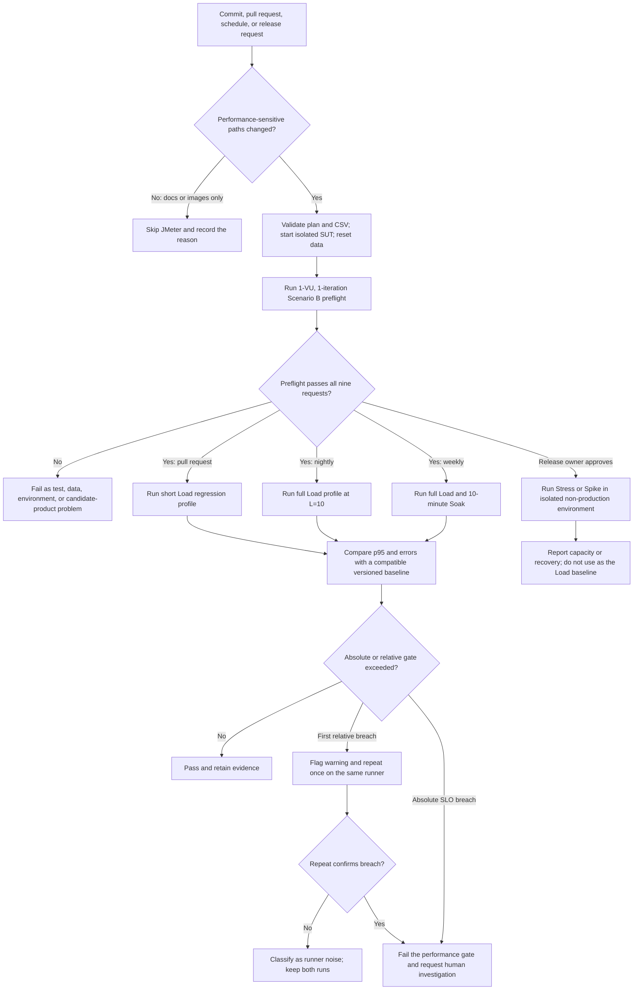

# Task 3 — Continuous Performance Testing Proposal

Review state: `HUMAN_VERIFIED`. On 2026-08-18, the student accepted the proposal from commit `3eef521`, including its path rules, execution tiers, p95 rule, and non-production restriction for Stress and Spike.

## 1. Objective and evidence basis

The model watches repository changes, selects the smallest useful Scenario B performance check, and flags comparable p95 regressions without treating one noisy run as a product defect. It preserves the complete business flow: login, product search and detail, cart, fixed coupon, checkout, coupon usage, and order history.

The initial reference comes from the accepted runs on host `TUANANH`:

| Profile | Accepted run | Raw p95 | Error rate | Purpose in the model |
|---|---|---:|---:|---|
| Load at `L = 10` | `23127280_Load_Official_20260818_002` | 9 ms | 0.00% | Initial full-Load reference |
| Stress through 30 VU | `23127280_Stress_Official_20260818_001` | 35 ms | 0.00% | Capacity context; not a PR baseline |
| Spike from 2 to 20 VU | `23127280_Spike_Official_20260818_002` | 58 ms | 0.00% | Recovery context; not a PR baseline |
| Soak for 10 minutes | `23127280_Soak_Official_20260818_002` | 9 ms | 0.00% | Stability and baseline-drift context |

These values are not interchangeable. A comparison is valid only when the current and baseline runs use the same JMX profile, JMeter version, hardware class, dataset/reset procedure, sample population, and percentile method. The pipeline records raw-JTL all-row p95 separately from HTML or parent-transaction statistics.

## 2. Commit watcher and decision flow

Performance-sensitive paths include `backend/server.js`, `backend/database.js`, backend dependencies, database migrations or seed logic, Scenario B JMX files, CSV fixtures, and JMeter runner or summarizer scripts. Documentation-only, screenshot-only, and unrelated frontend changes skip JMeter but leave an auditable skip reason.

## 3. Execution tiers

| Trigger | Proposed workload | Result |
|---|---|---|
| Relevant pull request | 1-VU preflight, then `L = 10`, ramp 30 seconds, hold 60 seconds | Fast regression signal before merge |
| Nightly schedule | Accepted Load shape at `L = 10`, ramp 120 seconds, hold 300 seconds | Stable comparable trend |
| Weekly schedule | Nightly Load plus a 10-minute Soak at `floor(0.7L) = 7` VU | Detect throughput or memory drift |
| Release candidate, manual approval | Stress stages through 30 VU or Spike from 2 to 20 VU | Capacity and recovery evidence |

The short pull-request profile needs its own baseline; it must not compare directly with Load `_002`. Before enforcing its relative gate, collect five clean runs on the dedicated runner and use their median p95 as baseline. Until then, the PR job enforces only correctness and the absolute SLO and reports relative results as informational.

Stress and Spike intentionally create saturation or abrupt overload. They require an isolated seeded environment, an explicit release-owner approval, resource stop conditions, and a unique run ID. They must never target production.

## 4. p95, error, and resource gates

The pipeline uses the Task 2 thresholds accepted for this repository:

- Fail immediately when error rate is at least 1% or comparable p95 is at least 2,000 ms.
- Flag a relative p95 regression only when p95 increases by both more than 20% and more than 10 ms against the compatible baseline median.
- Confirm a relative breach with one repeat on the same commit and runner. Fail the performance gate only if the repeat also breaches both limits.
- Warn when CPU exceeds 90%. Apply the emergency stop only when CPU exceeds 95% continuously for 60 seconds.
- Track physical RAM at start, ceiling, and finish. Flag possible leakage when repeated comparable Soak runs show a rising final value or a sustained upward trend; one peak is not enough.

The Load `_002` baseline illustrates the dual relative rule. Its raw p95 is 9 ms, so a change to 12 ms exceeds 20% but adds only 3 ms and remains noise-level information. A change above 19 ms exceeds both the 20% ratio and 10 ms floor and triggers confirmation. This example does not replace the absolute 2,000 ms SLO.

## 5. Noise, false alarms, and baseline drift

The runner uses a fixed JDK, JMeter version, CPU/RAM class, and operating-system image. Performance jobs run serially with no unrelated workload. Each measured run starts from an isolated data reset and a successful preflight so account lockout, coupon exhaustion, and growing order history do not masquerade as regressions.

A baseline bundle records the Git SHA, JMX hash, CSV/reset ID, JMeter and Java versions, runner identity, workload properties, aggregation scope, and summary method. The team creates a new baseline only after an intentional performance-affecting change and five clean comparable runs. It never silently replaces a bad result with a newer baseline.

The accepted Task 2 review shapes optimization testing:

- Changes that add the proposed composite indexes or order-history pagination trigger an A/B Load comparison with the same dataset and runner.
- A generic database pool is not added as a default pipeline action because the SUT uses a local SQLite file.
- Immediate Node clustering is excluded because cart state is process-local and requires an architecture change before workers can share state safely.

## 6. Artifacts, states, and notification

Every executed job uses a unique run ID and calls the existing guarded runner in `scripts/run-jmeter.ps1`, which refuses to overwrite a JTL or non-empty HTML report. `scripts/summarize-jtl.py` produces a read-only JSON summary from the raw JTL. The job retains:

- raw JTL and generated HTML report;
- summary JSON and decision result;
- reset snapshot, plan hash, CSV hash, commit SHA, and runner metadata;
- resource counters and logs;
- manifest hashes for tamper detection.

Automation produces candidate evidence without assigning human acceptance. The pipeline may pass or fail a CI gate, but only a student or reviewer may inspect and label evidence `HUMAN_VERIFIED`. One failed run creates a warning or failed job, not a GitHub defect. A defect requires repeatable evidence, exclusion of test, data, and environment causes, and explicit human confirmation. The proposal in this submission has completed that review and is `HUMAN_VERIFIED`.

## 7. Trade-offs

| Trade-off | Decision |
|---|---|
| Fast feedback versus representative load | Keep PR tests short; move the accepted full Load shape to nightly runs. |
| Cost versus leak detection | Run the 10-minute Soak weekly or before release, not on every commit. |
| Sensitivity versus false alarms | Combine a 20% ratio with a 10 ms floor and confirm relative breaches once. |
| Shared-runner cost versus stable metrics | Prefer one dedicated serial runner; otherwise treat relative p95 as informational. |
| Fresh baselines versus hidden regressions | Version baselines and require five clean runs plus human approval to replace one. |
| Broad coverage versus production safety | Keep Stress and Spike manual, isolated, resource-guarded, and outside production. |

## 8. Conclusion

This model spends the least time on low-risk commits and reserves expensive tests for schedules or release decisions. It flags p95 changes only within a compatible measurement scope, protects the absolute latency and error SLOs, and keeps noisy or failed automation separate from human-verified evidence. The design satisfies Task 3 as a proposal; `.github/workflows` currently contains no implemented workflow.

## Student decision

On 2026-08-18, Nguyễn Hiền Tuấn Anh accepted commit `3eef521` with the following decisions:

1. path-based run and skip rules accepted;
2. PR, nightly, weekly, and release tiers accepted;
3. p95 dual threshold and one-repeat rule accepted;
4. cost and false-alarm trade-offs accepted as part of the proposal;
5. Stress and Spike restricted to isolated non-production environments.

Review result: `HUMAN_VERIFIED`.
